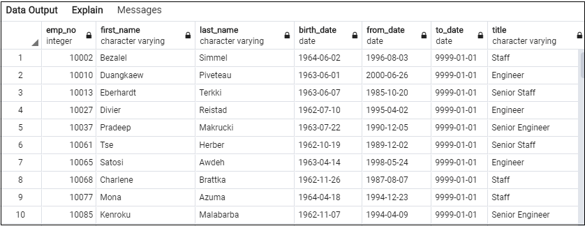

# Pewlett Hackard Analysis

## Overview

I have been tasked to help Bobby, an up and coming HR analyst, for  ***Pewlett Hackard***, a large company boasting several thousand employees. As baby boomers begin to retire at a rapid rate, Pewlett Hackard is looking toward the future in 2 ways.
1) First, it's offering a retirement package for those who meet certain criteria
2) Second, it's starting to think which positions will need to be filled in the near future. The number of upcoming retirements will leave thousands of job openings. What would happen to a company if they didn't look ahead and prepare for this many vacancies? It probably won't be pretty. 

Bobby, specifically, needs to find answers to the following questions.
* Who will be retiring in the next few years?  and 
* How many positions will Pewlett Packard need to fill?

This analysis will help future-proof Pewlett Hackard by generating a list of all employees eligible for the retirement package. The employee data Bobby needs is only available in the form of 6 CSVs because Pewlett Hackard has been mainly using Excel and VBA to work with their data. But now they have finally decide to update their methods and insted use SQL, a definite upgrade considering the amount of data. 

My task is to help Bobby build an employee database with SQL by applying my data modelling, engineering and analysis skills.

## Purpose of this Analysis
As a part of my past assignment at Pewlett Hackard, I analysed various factors and created the following tables.
1. retirement eligibility
2. retirement_info
3. current_emp
4. number_of_employees_retiring_per_department
5. manager_info
6. dept_info

Now Bobby's manager has given both of you two more assignments: determine the number of retiring employees per title, and identify employees who are eligible to participate in a mentorship program. Then, we’ll write a report that summarizes our analysis and helps prepare Bobby’s manager for the “silver tsunami” as many current employees reach retirement age.

## Analysis Results

Four major points from the two analysis deliverables. 

1) ### Retirement Titles 
    The total number of records retreived was **133,776**. However it does not tell us the correct number of people about to retire - there are a lot of duplicate entries. 
    
    **Image 1 (below): Table - Retirement Titles**

    
    
    
    The reason behind the duplicates records is that the data is coming straight out from the table **titles**, which contains all the titles that a person has ever held while working with Pewlett Hackard. The table **titles** has **443,308** records as compared to **300,024** in the table **employees**.

    TAKEAWAY - If we had a table that had the latest titles of all employees, many steps could have been saved. 
    
    In the past Pewlett Hackard was using EXCEL and VBA. Now, with SQL, we will create this table with a few lines of code
    ```
    SELECT  DISTINCT ON (emp_no)
	    emp_no,
	    title,
	    from_date,
	    to_date
    INTO latest_titles_of_employees
    FROM titles
    ORDER BY emp_no;
    ```
    This new table **latest_titles_of_employees** has **300,024** records, the same as the employees table. 

2) ### Unique Titles
    We retrieved the unique people that are set to retire. The number came out to **90,398**. With a total employee count of **300,024**, this points to the fact that **30.13%** of employees of Pewlett Hackard are set to retire.

    **Image 2 (below): Table - Unique Titles**

    

    The table and the % of people that are set to retire points to the tough task in front of the HR department. Assuming that Pewlett Hackard is not overstaffed, 30% of less workforce could have a dramatic effect on the productivity of the company and even its viability. The time to Act is NOW!

3) ### Retiring Titles
    This table shows the titles that are going to be most affected by the retirement. Almost 32.5% of all the people retiring will have the title **Senior Engineer**, and another almost 31% will have the title **Senior Staff**.
    
    HR might also want to see if the abysmally low number of managers is one of the reason that has got them to this point. Assuming a normal distribution, Managers are constituting **0.00002%** of the workforce. 

    **Image 3 (below): Table - Retiring Titles**

    

    While the HR team should work on replacing all titles, it should also think about increasing the % of managers, and having ongoing (bi-annual/quarterly) discussion about their staffing situations and needs.

3) ### Mentorship Eligibility

    The total number of people eligible for mentoring were **1,549**. This is **1.7%** of total titles to be replaced at **90,398**.

    **Image 4 (below): Table - Mentorship Eligibility**

    


## Summary

* How many roles will need to be filled as the "silver tsunami" begins to make an impact?

    The total number of people people that need to be filled is **90,398**

    The breakdown is 
    * Senior Engineers: 29,414
    * Senior Staff: 28,254
    * Engineer: 14,222
    * Staff: 12,243
    * Technique Leader: 4,502
    * Assistant Engineer: 1,761
    * Manager: 2

* Are there enough qualified, retirement-ready employees in the departments to mentor the next generation of Pewlett Hackard employees?

    With **90,398** people set to retire and the only 1,549 selected to be mentored, there are enough qualified, retirement-ready employees to mentor the next generation of employees. 
    
## Additional queries/tables   
  
1) We can run a query to group the canditates eligible for the mentorship program according to titles. This will give the HR a better insight and let them prepare better.
    
    **Script**
    ```
    SELECT count(title), 
        title
    INTO mentorship_eligibility_by_titles
    FROM mentorship_eligibilty
    GROUP BY title
    ORDER BY count DESC;
    ```    
   
    **Image 5 (below): Table - Mentorship Eligibility By Titles**  

    

    **Link to download the mentorship_eligibility_by_titles CSV file -** [**HERE**](https://github.com/Govind-Patwal/Pewlett-Hackard-Analysis/blob/master/Data/mentorship_eligibility_by_titles.csv)


2. The management selected the DOB between 1952 and 1955 while making the list of retiring employees

    A query can be run to see what will happen if the management applies the 3-year DOB criteria for the mentorship program. 

    **Script**

    ``` 
        SELECT DISTINCT ON (e.emp_no) 
            e.emp_no,
            e.first_name, 
            e.last_name,
            e.birth_date,
            de.from_date,
            de.to_date,
            ti.title
        INTO revised_mentorship_eligibilty	
        FROM employees as e
        INNER JOIN dept_employee as de
        ON e.emp_no = de.emp_no
        INNER JOIN titles as ti
        ON e.emp_no = ti.emp_no	
        WHERE (e.birth_date BETWEEN '1962-01-01' AND '1965-12-31')
        AND de.to_date = '9999-01-01'
        ORDER BY e.emp_no;
    ```
    **Image 5 (below): Table - Revised Mentorship Eligibility**  

    

    **Link to download the revised_mentorship_eligibilty CSV file -** [**HERE**](https://github.com/Govind-Patwal/Pewlett-Hackard-Analysis/blob/master/Data/revised_mentorship_eligibilty.csv)   

    **Result** - If the DOB criteria is broadned, the pool can be substantially increased - applying the criteria (DOB between 1962 to 1965) increases the number of people eligible for mentorship to **56,859** (a jump from 1.7% to 63%). 